# NicoOS 🐱

**NicoOS é um presente.** Fiz pra uma amiga minha: um bichinho virtual de bolso, estilo tamagotchi, do **Nico** — o melhor gato do mundo. Laranja e branco, orelhudo, com aquela cara de *"não tô impressionado"* que só ele sabe fazer.

Dentro do aparelhinho o Nico vive num quarto, anda sozinho, deita, se lambe, pede comida e reclama de banho. Você cuida dele, joga com ele pra ganhar moedinhas e compra petisco na loja. É um brinquedo — feito pra ser fofo, engraçado e durar.

<p align="center">
  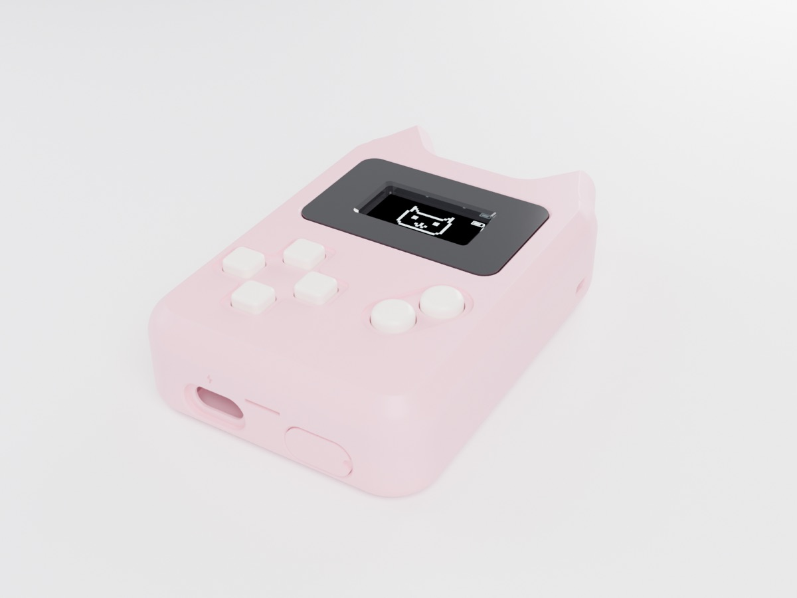
  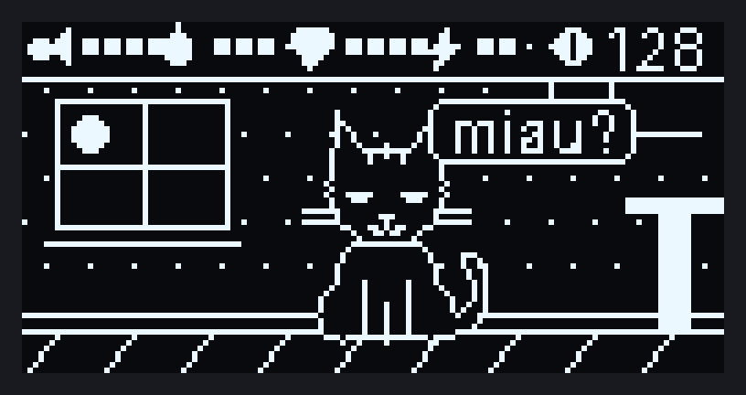
</p>

---

## O aparelho

Um handheld impresso em 3D com orelhas de gato, tela OLED, 6 botões, bateria recarregável e infravermelho.

| | | |
|---|---|---|
| 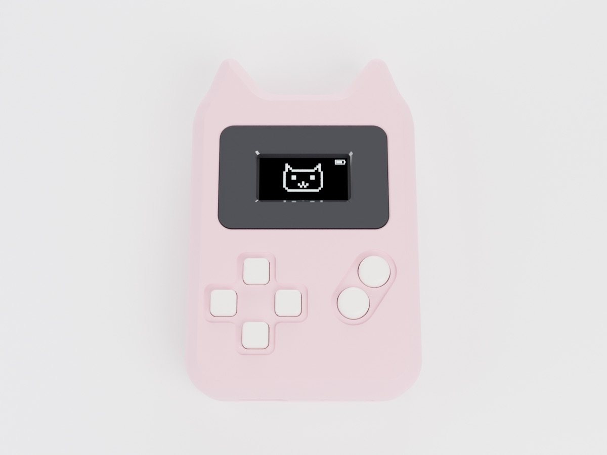 | 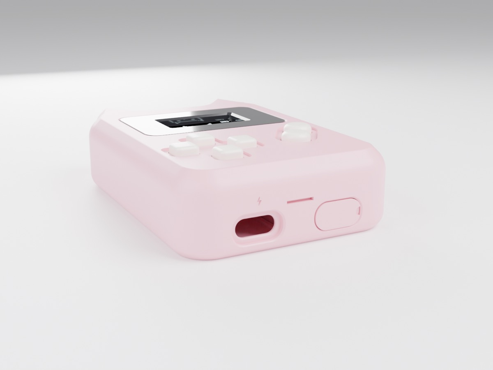 | 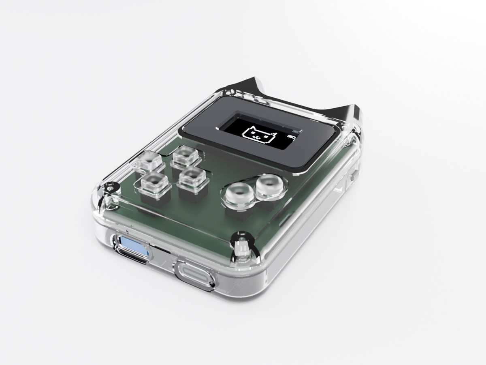 |
| Rosa, de frente | Borda de baixo: USB de carga (⚡) e a do ESP32 com tampinha | Versão transparente: dá pra ver tudo por dentro |

## As telas

| | |
|---|---|
|  | 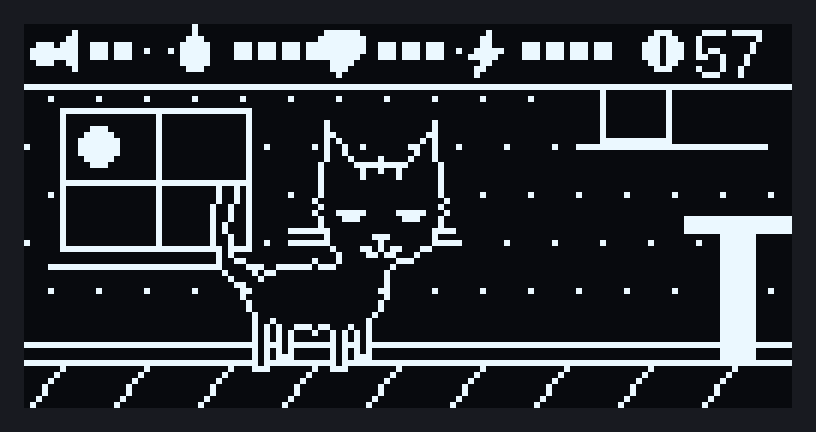 |
| O Nico no quarto dele, com fome/banho/humor/energia no topo | Ele anda sozinho pelo quarto |
| 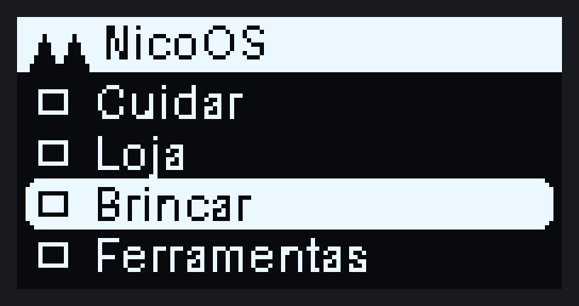 | 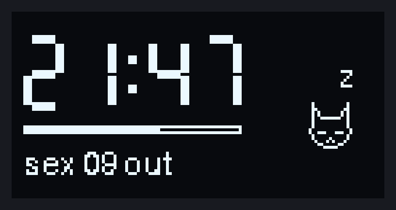 |
| Menu | Relógio (entra sozinho quando fica parado) |

*(mockups gerados a partir dos sprites reais — na tela o branco é azulado do OLED)*

<p align="center">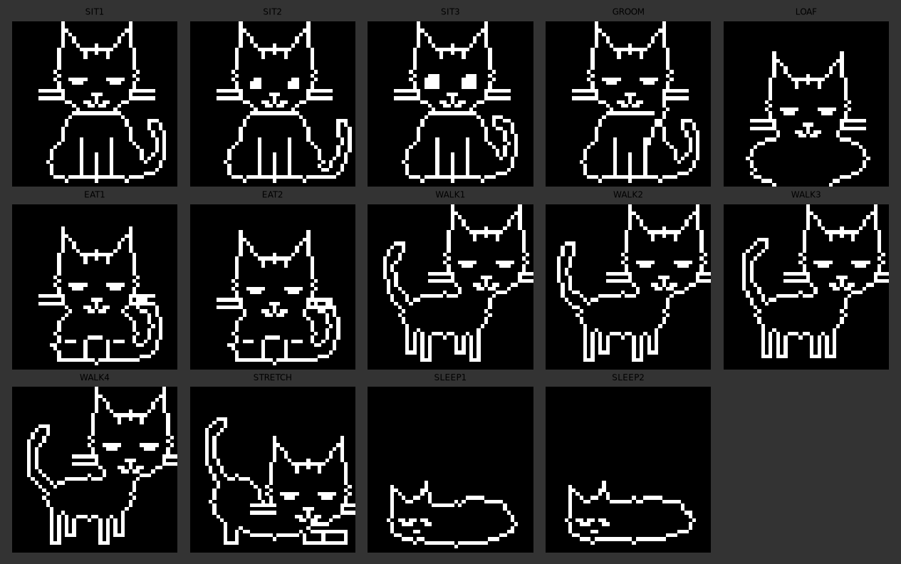<br><sub>Todas as poses do Nico em pixel art</sub></p>

## O que ele faz

- **Tamagotchi de verdade:** fome, banho, felicidade e energia caem com o tempo e ficam salvos mesmo desligando.
- **Nico vivo:** anda pelo quarto, senta, deita em pãozinho, se lambe, brinca de bolinha, se espreguiça e dorme. Os olhos mudam com o humor.
- **Controles na tela inicial:** ◄ ► ele anda · ▲ carinho (pula feliz) · ▼ deita / dorme · **B** chama ele · **A** menu.
- **Loja:** ração, peixe, bolo, sabonete e brinquedo, pagos com moedas.
- **Jogos (dão moedas):** Nico Kart, Flappy Nico, Snake, Pega-petisco e Pulo no Arranhador.
- **Relógio:** digital, analógico de gato (os olhos mexem a cada segundo) e um com o Nico deitado.
- **Rede do Nico:** cria uma rede Wi-Fi com nome engraçado ("NICO FODA", "papoi banana"…) e quem conecta vê uma pixel art do Nico.
- **Dormir:** cochilo (tela apaga) e deep sleep — qualquer seta ou o A acorda.

---

## Peças

| Peça | Qtd | Obs. |
|---|---|---|
| ESP32-C3 Super Mini | 1 | o cérebro |
| Tela OLED 0.96" I2C SSD1306 (128×64) | 1 | 4 pinos |
| Chave táctil 6×6×**4.3** mm | 6 | a altura importa |
| TP4056 **USB-C com proteção** | 1 | precisa ter OUT+ / OUT− |
| Bateria LiPo 3.7 V até 35×25×6 mm | 1 | usei 6×20×35, 400 mAh |
| Placa perfurada 5×7 cm | 1 | cortada pelo gabarito |
| LED infravermelho 5 mm 940 nm + resistor 100 Ω | 1 | |
| Receptor IR VS1838B | 1 | |
| Diodo Schottky 1N5817 | 1 | protege a bateria quando pluga a USB do ESP |
| Fio fino 28–30 AWG, fita dupla-face | — | |
| Parafuso M2×6 auto-atarraxante | 2 | **opcional**, o case fecha só no encaixe |

## O que imprimir

Tudo está em [`hardware/print/bini_cat_print.zip`](hardware/print/bini_cat_print.zip), já na posição certa pra mesa. **Nenhuma peça precisa de suporte.**

| Arquivo | Peça | Cor sugerida |
|---|---|---|
| `front_shell_FACE_DOWN.stl` | casca da frente (face na mesa) | a cor do aparelho |
| `back_shell.stl` | casca de trás (costas na mesa) | a cor do aparelho |
| `buttons_x6.stl` | 4 botões do direcional + A/B | creme / branco |
| `screen_bezel_FACE_DOWN.stl` | moldura da tela | **preto** |
| `usb_cap_esp32_FACE_DOWN.stl` | tampinha da USB do ESP32 | a cor do aparelho |

PLA ou PETG · bico 0.4 · camada 0.2 · 3 perímetros.

## Como montar

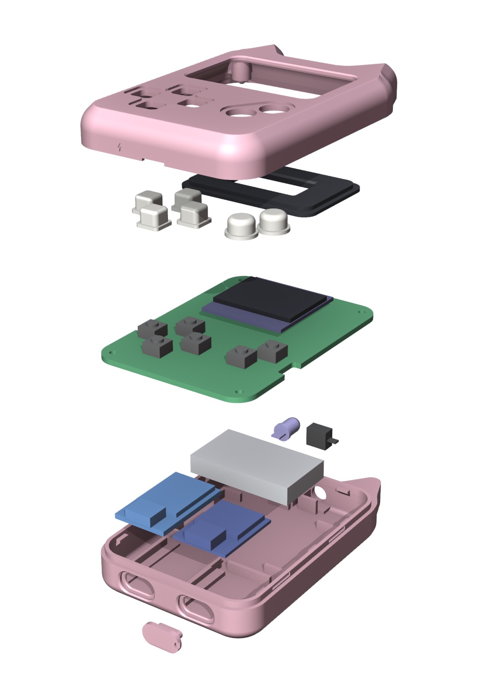

**1. Prepare a placa 5×7.** Imprima [`hardware/mainboard_template.svg`](hardware/mainboard_template.svg) em papel a 100 %, cole na placa, arredonde os cantos na lixa, faça os 4 furos de 2.2 mm e os dois entalhes laterais.

**2. Solde os 6 botões e a tela** no lado da frente da placa.

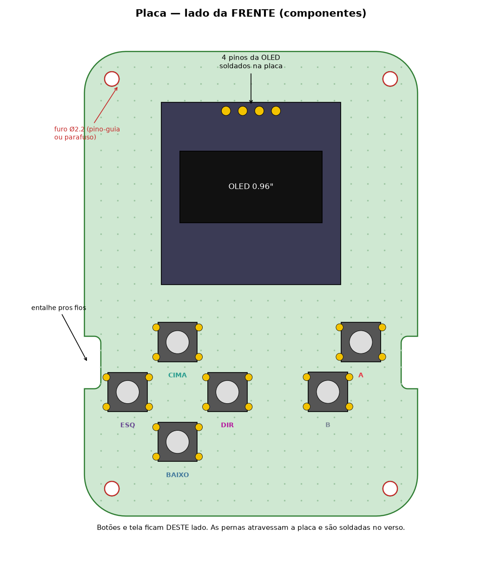

**3. Fios no verso:** um fio GND pulando de botão em botão até o GND da tela, e um fio de sinal na perna da diagonal de cada botão. Deixe ~8 cm de sobra e marque os fios.

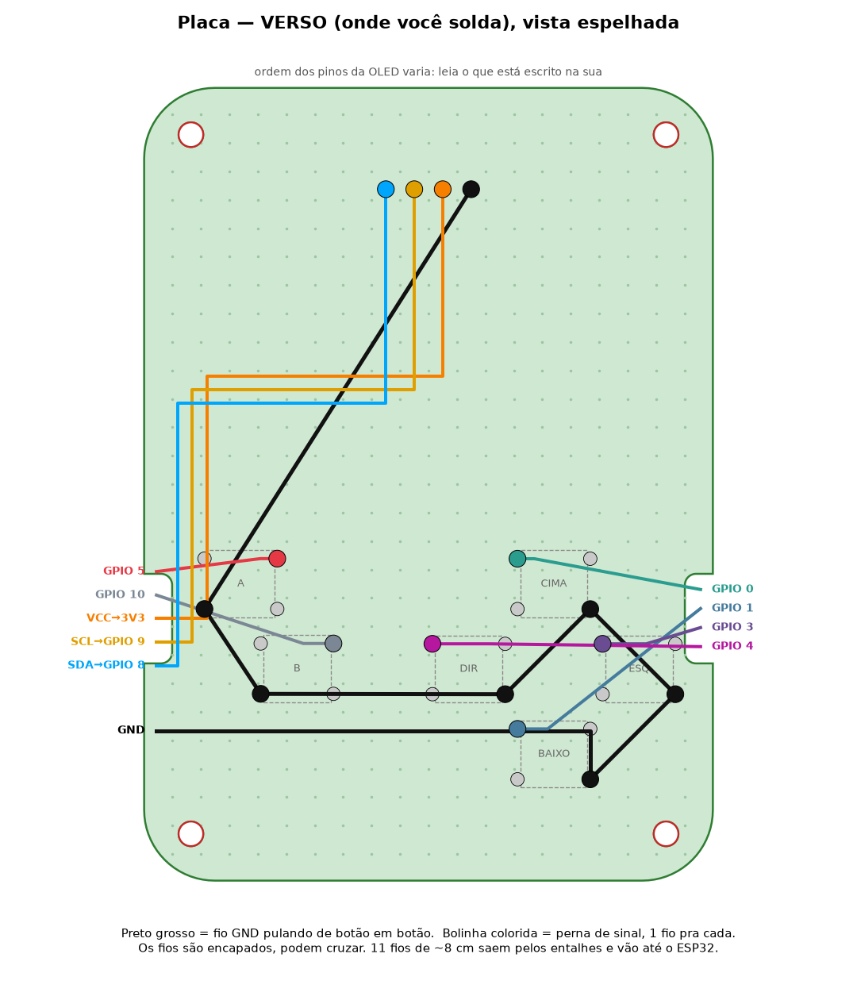

**4. Casca de trás:** encaixe o TP4056 e o ESP32 nos berços (plugue um cabo USB em cada um pra alinhar com o furo antes de colar), o LED IR no berço em U e o receptor no bolsinho do lado.

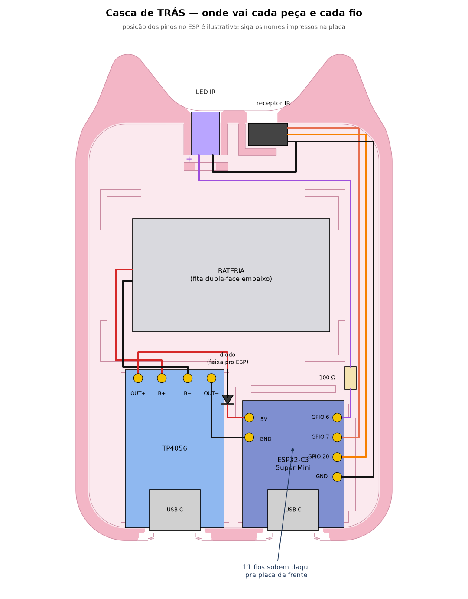

**5. Solde tudo seguindo o diagrama.** A bateria por último: preto no B−, depois vermelho no B+.

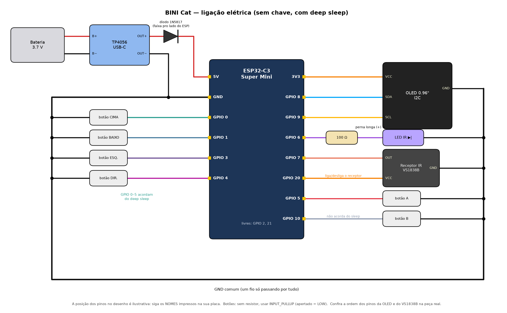

**6. Feche:** casca da frente com a face pra baixo → botões e moldura nos furos → placa nos pinos-guia → casca de trás por cima, aperte até ouvir os 4 cliques. Pra abrir: unha na fenda da borda de baixo.

<p align="center">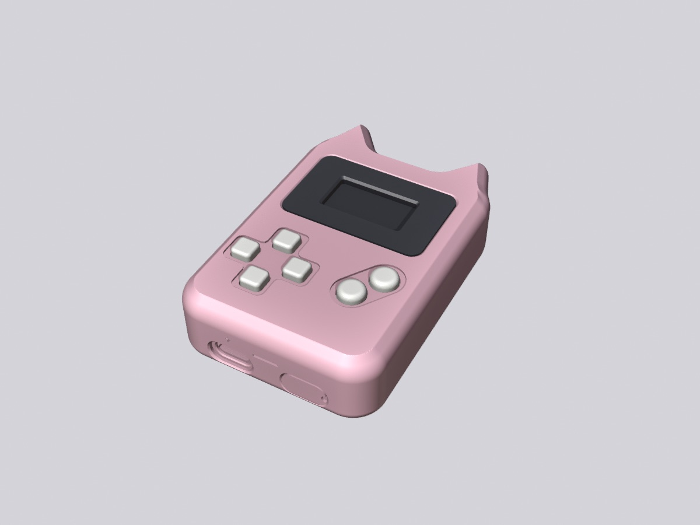</p>

### Pinagem

| Pino do ESP32-C3 | Liga em |
|---|---|
| GPIO 0 / 1 / 3 / 4 | botão Cima / Baixo / Esquerda / Direita |
| GPIO 5 / 10 | botão A / B |
| GPIO 8 / 9 | OLED SDA / SCL |
| GPIO 6 | LED IR (via 100 Ω) |
| GPIO 7 / 20 | receptor IR sinal / VCC |
| 3V3 | VCC da OLED |
| 5V | TP4056 OUT+ (via diodo, faixa pro ESP) |
| GND | todos os GND |

> ⚠️ **Bateria de lítio:** nunca encoste os fios vermelho e preto. Sem o diodo, **não plugue a USB do ESP32 com a bateria ligada.** A carga é sempre pela USB com o ⚡.

## Gravar o NicoOS

Precisa do [PlatformIO](https://platformio.org/). Com o ESP32 no USB:

```bash
pio run -t upload
```

A porta está fixa em `platformio.ini` (`/dev/cu.usbmodem101`) — troque se a sua for outra. Se não gravar: segure **BOOT**, aperte **RESET**, solte o BOOT e tente de novo.

## Mexer no projeto

- **Firmware:** `src/` — `main.cpp` (telas e menus), `nico.h` (o gato e o comportamento), `games.h`, `clockapp.h`, `wifitools.h`, `config.h` (pinos).
- **Desenho do Nico:** `tools/gen_sprites.py` gera `src/sprites.h`. Mude, rode `python tools/gen_sprites.py`, grave de novo.
- **Case:** `hardware/case/` — gerador paramétrico em Python (`params.py` + `build.py`). Medidas de peça, folgas, orelhas, tudo ajustável.

```
NicoOS/
├── src/            firmware (ESP32-C3, Arduino/PlatformIO)
├── tools/          gerador dos sprites e dos mockups
├── hardware/
│   ├── print/      STLs prontos pra imprimir (.zip)
│   ├── case/       gerador paramétrico do case
│   └── mainboard_template.svg
└── img/            renders e telas
```

## Créditos

O case foi desenhado em cima do [*printble gaming device*](https://grabcad.com/library/printble-gaming-device-1) do **pinabini** (GrabCAD), refeito com orelhas, cantos arredondados e espaço pra bateria, ESP32-C3 e infravermelho.

Feito com carinho pro Nico. 🧡
